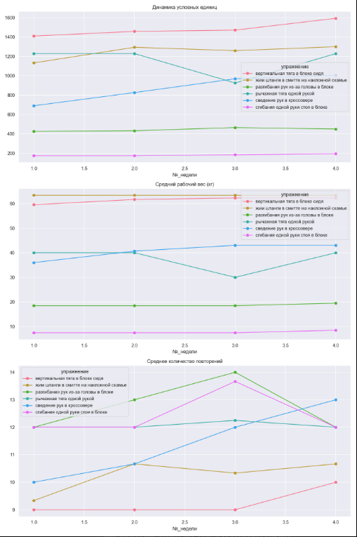

# GymBot: Аналитический телеграм-бот для трекинга силовых тренировок

Бот для профессионального анализа прогресса в силовых тренировках с акцентом на работу с субмаксимальными весами (~80% от 1ПМ). Интеграция с Google Sheets позволяет хранить всю историю тренировок и визуализировать прогресс.

## 🎯 Для кого этот бот
- Тренируетесь с весами 70-85% от 1ПМ
- Используете сплит Upper/Lower (4 дня в неделю)
- Хотите объективно оценивать прогресс
- Готовы вносить данные после каждой тренировки

##  Настройка Google Sheets
1. Создайте таблицу "training" с листами: `upper1`, `lower1`, `upper2`, `lower2`
2. Структура таблицы: №_недели | упражнение | №_подхода | вес_кг | повторения | дата | разгрузка

## 🚀 Ключевые функции
### 📊 Аналитика прогресса
- Расчет **условных единиц усилий** (учитывает вес, повторения и коэффициент сложности)
- Сравнение показателей за:
  - Неделю
  - Месяц
  - Весь период тренировок
- Тренды по основным метрикам

### 📈 Автоматизированные отчеты
- Графики динамики показателей
- Детализация по каждому упражнению
- Выявление стагнации/регресса

### 🔄 ETL-пайплайн
- Хранение данных в Google Sheets
- Автоматическая обработка новых записей
- Расчет производных метрик

## 🔍 Пример аналитики

📊 Аналитика за неделю

📈 жим штанги в смитте на наклонной скамье
  Усл.единицы: 1258 → 1299 (+41)
🏋️ Средний вес: 63.3кг → 63.3кг (+0.0кг)
🔄 Повторения: 10 → 11 (+0)
✖️ Подходов: 3

📈 вертикальная тяга в блоке сидя
  Усл.единицы: 1470 → 1592 (+122)
🏋️ Средний вес: 62.2кг → 62.2кг (+0.0кг)
🔄 Повторения: 9 → 10 (+1)
✖️ Подходов: 4

📈 сведение рук в кроссовере
  Усл.единицы: 968 → 1005 (+37)
🏋️ Средний вес: 43.0кг → 43.0кг (+0.0кг)
🔄 Повторения: 12 → 13 (+1)
✖️ Подходов: 3

📈 рычажная тяга одной рукой
  Усл.единицы: 925 → 1228 (+303)
🏋️ Средний вес: 30.0кг → 40.0кг (+10.0кг)
🔄 Повторения: 12 → 12 (-0)
✖️ Подходов: 4

📈 разгибания рук из-за головы в блоке
  Усл.единицы: 465 → 450 (-15)
🏋️ Средний вес: 18.5кг → 19.5кг (+1.0кг)
🔄 Повторения: 14 → 12 (-2)
✖️ Подходов: 3

📈 сгибания одной руки стоя в блоке
  Усл.единицы: 184 → 195 (+11)
🏋️ Средний вес: 7.5кг → 8.5кг (+1.0кг)
🔄 Повторения: 14 → 12 (-2)
✖️ Подходов: 3